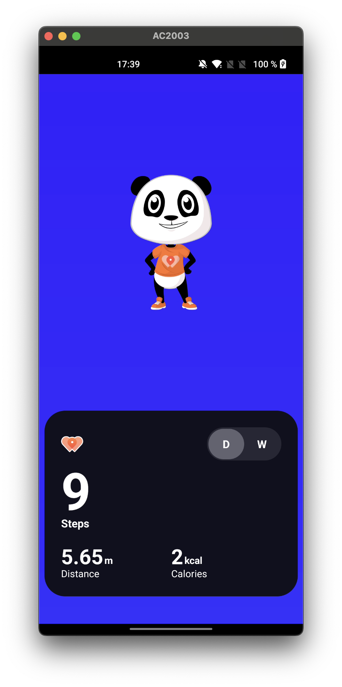

# 🚀 Test Technique WeWard : Health Data App

  

## 🎯 Objectif du Projet

Ce projet est une implémentation simple d'un compteur de pas sur **React Native**, réalisée dans le cadre d'un test technique pour WeWard.

L'objectif principal était d'intégrer le comptage de pas en utilisant la **Recording API** du module **Google Fit (Android)** pour garantir une consommation d'énergie minimale et une fiabilité des données.

---
## 📱 Ecrans bonus

J'ai rajouté des écrans Bonus pour expliquer au User pourquoi on a besoin de la permission, l'orienter s'il refuse, ainsi qu'un splashscreen basique.

---

## ⏳ Timebox & Contraintes

J'ai choisi de *timeboxer* cet exercice à **3 heures** pour simuler un véritable "challenge" technique et pour laisser des pistes de discussion pour l'entretien.

> ⏱️ **Note sur le temps :** Environ **1h10** de ce temps a été consacré à la résolution de problèmes d'environnement React Native (nouveau Mac qui a 2 semaines !, configuration JDK, sélection des versions, etc.). Le temps restant a été pleinement dédié au développement de la fonctionnalité.

---

## ⚙️ Choix Techniques & Architecture

### ⚛️ Stack Technique

* **Framework :** React Native
* **Plateforme cible :** Android (pour l'intégration Google Fit Recording API)
* **Comptage de Pas :** Google Fit Recording API (via un **Native Module** Android)

### 📂 Architecture : Vers le **Feature-Based Design**

Pour une petite application comme celle-ci, une architecture classique (avec des dossiers `components`, `screens`, `store`, `thunks`, etc.) aurait été suffisante.

Cependant, j'ai profité de l'occasion pour initier une structure orientée **Feature-Based Design**.

Même sans appels API complexes ni de base de données locale, cette approche est plus **évolutive**. Même si pas de Repository et d'abstraction pour l'instant, ça ouvre à une séparation des domaines. Je suis quelqu'un d'ouvert à tout type d'archi (sauf spaghetti 😂), y'a toujours des avantages et inconvénients à chacune.

### 🎨 Design & Intégration Figma

J'ai essayé de coller au maximum au design fourni par **Figma**.

Étant donné que React Native utilise les **densité-indépendantes pixels (dp)** et non les pixels (px) natifs du design, j'ai dû ajuster les valeurs "à l'œil" pour obtenir le rendu visuel le plus fidèle possible sur les différentes densités d'écran. Ça rendait bizarre avec les valeurs du Figma

---

## 🛠️ Pistes d'Amélioration & Prochaines Étapes

Selon moi, avec plus de temps, voici les axes sur lesquels j'aurais pu aller plus loin :

### 1. **Abstraction du Module Natif (Android)**

* **Le Concept :** Aujourd'hui, on utilise la Recording API, mais si demain les besoins changent (ex: autre API ou autre source de données), je ne veux pas que ça impacte tout le code React Native.
* **La Solution :** Mettre en place une **Interface** côté Android pour le module de *Fitness*. L'implémentation actuelle de la Recording API deviendrait une classe concrète. Cela assure une **isolation totale** de la logique de comptage.
* Utiliser **Hilt** (ou Koin) pour l'injection de dépendances côté Android permettrait de basculer d'une implémentation à une autre sans modifier l'application.

### 2. **Localisation / Internationalisation (i18n)**

* **Le Concept :** Rendre l'application prête pour plusieurs langues.
* **La Solution :** Traduire tous les textes statiques avec **i18n**.

### 3. **Fonts**

* **La Solution :** Intégrer la police de caractères **Inter** pour coller parfaitement au design.

### 4. **Tests**
Le développement a été priorisé sur l'implémentation du cœur de la fonctionnalité. J'ai néanmoins conscience que la couverture de tests est essentielle pour la stabilité et la maintenabilité à long terme.

📝 Stratégie de Test

Tests Unitaires (Jest) : Couverture des fonctions utilitaires et de la logique métier côté Typescript pour garantir leur fiabilité.

Tests d'Intégration / E2E :
Le point critique est la validation de la communication bidirectionnelle entre React Native et le Native Module Android.
Tester les scénarios liés aux permissions Google Fit (acceptation, refus, états intermédiaires), cruciaux pour l'UX.
En résumé : Mon attention aurait porté en priorité sur la robustesse de l'intégration native, cœur de cet exercice technique.

### 5. **Mise à Jour des Données en Temps Réel (Live Update)**

* **Le Concept :** Pour une meilleure expérience utilisateur, rafraîchir les données sans nécessiter une action manuelle.
* **La Solution :** Mettre en place un mécanisme de rafraîchissement périodique (ex : toutes les 30 secondes) via un simple **`useEffect`** bien géré (avec un `setInterval` et un nettoyage via la fonction de retour de `useEffect` pour éviter les fuites de mémoire). *Ceci n'était pas dans les consignes, j'ai donc choisi de ne pas le faire pour rester focus sur le cœur de la demande.*

### 6. **Réflexion Architecturale Avancée**

* J'ai récemment découvert le **Feature-Sliced Design** (`https://feature-sliced.design/`) et je trouve que c'est une approche très pertinente pour les applications mobiles complexes. J'ai hésité à l'implémenter, mais par souci de rigueur (et de temps !), je n'ai pas voulu tenter une architecture que je n'avais pas encore suffisamment approfondie.

---

## 🛠️ Démarrer le Projet

(Vous savez déjà comment faire mais c'est pour peupler le README 😂)

1.  Cloner le dépôt : `git clone [URL]`
2.  Installer les dépendances : `npm install` ou `yarn install`
3.  Lancer sur Android : `yarn android`
---
